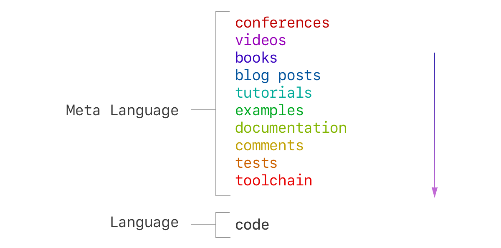

<section>
  <section>
    
  </section>
  <section>
    
  </section>
  <section style="flex-direction: row">
    

      <h2>JavaScript</h2>
      <pre class="language-javascript" data-src="examples/js.js"></pre>
    

    

      <h2>Reason</h2>
      <pre class="language-reason" data-src="examples/js.re"></pre>
    

  </section>
</section>

<section>
  <section>
    <h1>so what's the <i style="color: #cbaabc;">reason</i> for all of this, anyway?</h1>
  </section>
  <section>
    <h1>who here has dealt with a runtime error?</h1>
  </section>
  <section>
    <h1>null</h1>
    <h2>hoare's billion dollar mistake</h2>
  </section>
  <section>
    <h1>unit tests can only tell you when something is broken</h1>
    <h2>they can't tell you that something is ok</h2>
  </section>
  <section>
    <h1>make illegal states unrepresentable</h1>
  </section>
  <section>
    <pre class="language-javascript" data-src="examples/brokencontroller.js"></pre>
  </section>
</section>

<section>
  <section>
    <h1>but jacob <small><i>I hear you say</i></small></h1>
    <h2>there are <i>already</i> type systems for javascript</h2>
  </section>
</section>

<section>
  <section>
    <h1>flow</h1>
  </section>
  <section>
    <pre class="language-javascript" data-src="examples/flow1.js"></pre>
  </section>
  <section>
    <pre class="language-reason" data-src="examples/flow1.re"></pre>
  </section>
  <section style="flex-direction: row">
    

      
    

    

      <h3>merlin says</h3>
      
this pattern-matching is not exhaustive.

      
Here is an example of a value that is not matched: C

    

  </section>
</section>
<section>
  <section>
    <h1>typescript</h1>
  </section>
  <section>
    <pre class="language-javascript" data-src="examples/typescript1.js"></pre>
  </section>
  <section>
    <pre class="language-reason" data-src="examples/typescript1.re"></pre>
  </section>
  <section style="flex-direction: row">
    

      
    

    

      <h3>merlin says</h3>
      
This expression has type Js.t { baz : 'a }

      
but an expression was expected of type Js.t { bar : Js.fn [ `Arity_0 ] 'b, .. }

      
The first object type has no method bar

    

  </section>
</section>

<section>
  <section>
    <h1>the year<i style="opacity: 0;">s</i> of javascript <i>fatigue</i></h1>
  </section>
  <section>
    <h1>the year<i style="color: #cbaabc;">s</i> of javascript <i>fatigue</i></h1>
  </section>
  <section>
    
  </section>
  <section>
    <h1>safe by default</h1>
    <h2>you need to take off the parachute, not put it on</h2>
  </section>
</section>

<section>
  <section>
    <h1>hello world!</h1>
  </section>
  <section>
    <pre class="language-javascript" data-src="examples/express1.js"></pre>
  </section>
  <section>
    <pre class="language-reason" data-src="examples/express1.re"></pre>
  </section>
  <section>
    <h3>open Express;</h3> 
is kind of like
 <h3>const express = require('express');</h3>
  </section>
  <section>
    <pre class="language-reason" data-src="examples/expressmodule.re"></pre>
  </section>
  <section>
    <pre class="language-reason" data-src="examples/express2.re"></pre>
  </section>
  <section>
    <h1>type route = A | B | C;</h1>
    <h3>define the allowed members of the type</h3>
  </section>
  <section>
    <pre class="language-reason" data-src="examples/adtexample.re"></pre>
  </section>
  <section>
    <pre class="language-reason" data-src="examples/express3.re"></pre>
  </section>
  <section>
    <pre class="language-reason" data-src="examples/express4.re"></pre>
  </section>
  <section>
    <h1>FFI?</h1>
    <h3>binding to existing JS code</h3>
  </section>
  <section>
    <pre class="language-reason" data-src="examples/ffiexample.re"></pre>
  </section>
  <section>
    <h1>Typed Templating</h1>
  </section>
  <section>
    <pre class="language-reason" data-src="examples/mysimpletemplate.re"></pre>
  </section>
  <section>
    <h2>Real World Example:</h2><h2>github.com/bassjacob/bassjacob.com</h2>
  </section>
</section>

<section>
  <section>
    <pre class="language-javascript" data-src="examples/spaghetti"></pre>
  </section>
  <section>
    <pre class="language-jsx" data-src="examples/react"></pre>
  </section>
  <section>
    <pre class="language-javascript" data-src="examples/flow"></pre>
  </section>
  <section>
    <pre class="language-haskell" data-src="examples/haskell"></pre>
  </section>
  <section>
    
  </section>
</section>

<section>
  <section>
    <h1>a new meetup</h1>
    <h2><a href="https://www.meetup.com/reason-sydney/">meetup.com/reason-sydney</a></h2>
  </section>
  <section>
    <h3>https://discord.gg/reasonml</h3>
  </section>
</section>